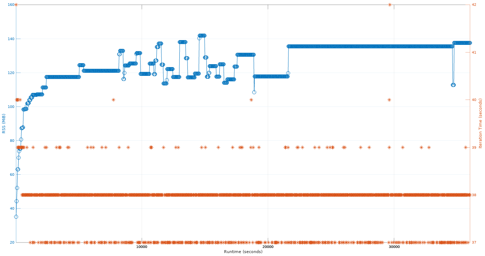

# extractloop.bash results

Memory usage stabilises at 141MiB, we do not run out of fds,
and the iteration time is stable around 38 seconds:



What the extractloop stress test does is (top comment in `tests/stress_tests/extractloop.bash`):

```
# Mount a gocryptfs filesystem somewhere on /tmp, then run two parallel
# infinite loops inside that do the following:
# 1) Extract linux-3.0.tar.gz
# 2) Verify the md5sums
# 3) Delete, go to (1)
#
# This test is good at discovering inode-related memory leaks because it creates
# huge numbers of files.
```

Test output (trimmed for brevity):
```
~/go/src/github.com/rfjakob/gocryptfs/tests/stress_tests$ ./extractloop.bash

20803 (process ID) old priority 0, new priority 19
Testing gocryptfs
Test dir: /tmp/extractloop_tmpdir/SMc
'/tmp/extractloop.csv' -> '/tmp/extractloop_tmpdir/SMc.csv'
[looper 2] Starting
[looper 1] Starting
[looper 2] Iteration 1 done, 42 seconds, RSS 36020 kiB
[looper 1] Iteration 1 done, 42 seconds, RSS 36020 kiB
[looper 2] Iteration 2 done, 40 seconds, RSS 45400 kiB
[looper 1] Iteration 2 done, 40 seconds, RSS 45400 kiB
[looper 1] Iteration 3 done, 40 seconds, RSS 53396 kiB
[looper 2] Iteration 3 done, 40 seconds, RSS 53396 kiB
[looper 1] Iteration 4 done, 39 seconds, RSS 64588 kiB
[looper 2] Iteration 4 done, 40 seconds, RSS 64588 kiB
[looper 1] Iteration 5 done, 40 seconds, RSS 64588 kiB
[looper 2] Iteration 5 done, 39 seconds, RSS 64588 kiB
[looper 1] Iteration 6 done, 39 seconds, RSS 71628 kiB
[...]
[looper 1] Iteration 945 done, 38 seconds, RSS 140832 kiB
[looper 2] Iteration 946 done, 38 seconds, RSS 140832 kiB
[looper 1] Iteration 946 done, 38 seconds, RSS 140832 kiB
[looper 1] Iteration 947 done, 37 seconds, RSS 140832 kiB
[looper 2] Iteration 947 done, 37 seconds, RSS 140832 kiB
[looper 1] Iteration 948 done, 38 seconds, RSS 140832 kiB
[looper 2] Iteration 948 done, 38 seconds, RSS 140832 kiB
[looper 1] Iteration 949 done, 38 seconds, RSS 140832 kiB
[looper 2] Iteration 949 done, 38 seconds, RSS 140832 kiB
[looper 1] Iteration 950 done, 38 seconds, RSS 140832 kiB
[looper 2] Iteration 950 done, 38 seconds, RSS 140832 kiB
[looper 1] Iteration 951 done, 38 seconds, RSS 140832 kiB
[looper 2] Iteration 951 done, 38 seconds, RSS 140832 kiB
```
