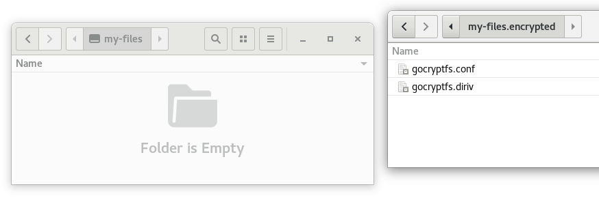

[](https://nuetzlich.net/gocryptfs/)
[](https://github.com/rfjakob/gocryptfs/actions/workflows/ci.yml)
[](LICENSE)
[](https://goreportcard.com/report/github.com/rfjakob/gocryptfs)
[](https://github.com/rfjakob/gocryptfs/releases)
[](https://formulae.brew.sh/formula/gocryptfs#default)

An encrypted overlay filesystem written in Go.
Official website: https://nuetzlich.net/gocryptfs ([markdown source](https://github.com/rfjakob/gocryptfs-website/blob/master/docs/index.md)).



gocryptfs is built on top the excellent
[go-fuse](https://github.com/hanwen/go-fuse) FUSE library.
This project was inspired by EncFS and strives to fix its security
issues while providing good performance
([benchmarks](https://nuetzlich.net/gocryptfs/comparison/#performance)).
For details on the security of gocryptfs see the
[Security](https://nuetzlich.net/gocryptfs/security/) design document.

All tags from v0.4 onward are signed by the *gocryptfs signing key*.
Please check [Signed Releases](https://nuetzlich.net/gocryptfs/releases/)
for details.

Current Status
--------------

gocryptfs has reached version 1.0 on July 17, 2016. It has gone through
hours and hours of stress (fsstress, extractloop.bash) and correctness
testing (xfstests). It is now considered ready for general consumption.

The old principle still applies: Important data should have a backup.
Also, keep a copy of your master key (printed on mount) in a safe place.
This allows you to access the data even if the gocryptfs.conf config
file is damaged or you lose the password.

The security of gocryptfs has been audited in March 3, 2017. The audit
is available [here (defuse.ca)](https://defuse.ca/audits/gocryptfs.htm).

Platforms
---------

Linux is gocryptfs' native platform.

Beta-quality macOS support is available, which means most things work
fine but you may hit an occasional problem. Check out
[ticket #15](https://github.com/rfjakob/gocryptfs/issues/15) for the history
of macOS support but please create a new ticket if you hit a problem.

For Windows, an independent C++ reimplementation can be found here:
[cppcryptfs](https://github.com/bailey27/cppcryptfs)

A standalone Python tool that can decrypt files & file names is here:
[gocryptfs-inspect](https://github.com/slackner/gocryptfs-inspect)

Installation
------------
Precompiled binaries that work on all x86_64 Linux systems are available
for download from the github releases page. The `fuse` package from your
distribution must be installed for mounting to work.

gocryptfs is also available as a package in most distributions. Examples:

* Debian, Ubuntu: `apt install gocryptfs`
* Arch: `pacman -S gocryptfs`
* MacPorts: `port install gocryptfs`

See the [Quickstart](https://nuetzlich.net/gocryptfs/quickstart/) page for more info.

Testing
-------

gocryptfs comes with is own test suite that is constantly expanded as features are
added. Run it using `./test.bash`. It takes about 1 minute and requires FUSE
as it mounts several test filesystems.

The `stress_tests` directory contains stress tests that run indefinitely.

In addition, I have ported `xfstests` to FUSE, the result is the
[fuse-xfstests](https://github.com/rfjakob/fuse-xfstests) project. gocryptfs
passes the "generic" tests with one exception, results:  [XFSTESTS.md](Documentation/XFSTESTS.md)

A lot of work has gone into this. The testing has found bugs in gocryptfs
as well as in the go-fuse library.

Compile
-------

Install Go 1.13 or higher:

* Debian/Ubuntu: `apt install golang`
* Fedora: `dnf install golang`

Then, download the source code and compile:

	$ git clone https://github.com/rfjakob/gocryptfs.git
	$ cd gocryptfs
	$ ./build-without-openssl.bash

This will compile a static binary that uses the Go stdlib crypto backend.

If you want to use the OpenSSL crypto backend (faster on
old CPUs lacking AES-NI), you have to install a few dependencies:

* Debian/Ubuntu: `apt install libssl-dev gcc pkg-config`
* Fedora: `dnf install openssl-devel gcc pkg-config`

Then, run:

	$ ./build.bash

Use
---

	$ mkdir cipher plain
	$ ./gocryptfs -init cipher
	$ ./gocryptfs cipher plain

See the [Quickstart](https://nuetzlich.net/gocryptfs/quickstart/) page for more info.

The [MANPAGE.md](Documentation/MANPAGE.md) describes all available command-line options.

Use: Reverse Mode
-----------------

    $ mkdir cipher plain
    $ ./gocryptfs -reverse -init plain
    $ ./gocryptfs -reverse plain cipher

Graphical Interface
-------------------

The [SiriKali](https://mhogomchungu.github.io/sirikali/) project supports
gocryptfs and runs on Linux and OSX.

[cppcryptfs](https://github.com/bailey27/cppcryptfs) on Windows provides
its own GUI.

Stable CLI ABI
--------------

If you want to call gocryptfs from your app or script, see
[CLI_ABI.md](Documentation/CLI_ABI.md) for the official stable
ABI. This ABI is regression-tested by the test suite.

Storage Overhead
----------------

* Empty files take 0 bytes on disk
* 18 byte file header for non-empty files (2 bytes version, 16 bytes random file id)
* 32 bytes of storage overhead per 4kB block (16 byte nonce, 16 bytes auth tag)

[file-format.md](Documentation/file-format.md) contains a more detailed description.

Performance
-----------

Since version 0.7.2, gocryptfs is as fast as EncFS in the default mode,
and significantly faster than EncFS' "paranoia" mode that provides
a security level comparable to gocryptfs.

On CPUs without AES-NI, gocryptfs uses OpenSSL through a thin wrapper called `stupidgcm`.
This provides a 4x speedup compared to Go's builtin AES-GCM
implementation. See [CPU-Benchmarks](https://github.com/rfjakob/gocryptfs/wiki/CPU-Benchmarks)
for details, or run `gocryptfs -speed` to see the encryption performance of your CPU.
Example for a CPU with AES-NI:

```
$ ./gocryptfs -speed
gocryptfs v2.2.0-beta1-5-g52b0444-dirty; go-fuse v2.1.1-0.20210825171523-3ab5d95a30ae; 2021-09-14 go1.17.1 linux/amd64
cpu: Intel(R) Core(TM) i5-3470 CPU @ 3.20GHz; with AES acceleration
AES-GCM-256-OpenSSL              862.79 MB/s
AES-GCM-256-Go                   997.71 MB/s    (selected in auto mode)
AES-SIV-512-Go                   159.58 MB/s
XChaCha20-Poly1305-OpenSSL   729.65 MB/s
XChaCha20-Poly1305-Go            843.97 MB/s    (selected in auto mode)
```

You can run `./benchmark.bash` to run gocryptfs' canonical set of
benchmarks that include streaming write, extracting a linux kernel
tarball, recursively listing and finally deleting it. The output will
look like this:

```
$ ./benchmark.bash
Testing gocryptfs at /tmp/benchmark.bash.xFD: gocryptfs v2.0; go-fuse v2.1.1-0.20210508151621-62c5aa1919a7; 2021-06-06 go1.16.5 linux/amd64
WRITE: 262144000 bytes (262 MB, 250 MiB) copied, 0,698174 s, 375 MB/s
READ:  262144000 bytes (262 MB, 250 MiB) copied, 0,268916 s, 975 MB/s
UNTAR: 8,970
MD5:   4,846
LS:    1,851
RM:    2,367
```

Changelog
---------

#### v2.3.2, 2023-04-29
* Fix incorrect file size reported after hard link creation
  ([#724](https://github.com/rfjakob/gocryptfs/issues/724))

#### v2.3.1, 2023-03-04
* Optimize NFS streaming write performance ([#712](https://github.com/rfjakob/gocryptfs/issues/712),
  [commit](https://github.com/rfjakob/gocryptfs/commit/8f3ec5dcaa6eb18d11746675190a7aaceb422764)).
  You should see about a 4x performance increase.
* Use `debug.ReadBuildInfo()` to provide some
  version information even when not built with `build.bash` ([#701](https://github.com/rfjakob/gocryptfs/pull/701)) .
* Fix bug that caused the `logger` process to be killed when started from `xfce4-terminal`,
  and that terminal window was closed ([#660](https://github.com/rfjakob/gocryptfs/issues/660),
  [commit](https://github.com/rfjakob/gocryptfs/commit/ff32e9979130e6237b0d97ef88304fa79ce61b06)).
* MacOS: Fix reverse mount failing with `read-only file system` ([#690](https://github.com/rfjakob/gocryptfs/pull/690))
* Make gocryptfs compile on riscv64 by switching from [jacobsa/crypto](https://github.com/jacobsa/crypto)
  to maintained fork [aperturerobotics/jacobsa-crypto](https://github.com/aperturerobotics/jacobsa-crypto)
  ([#674](https://github.com/rfjakob/gocryptfs/pull/674))

#### v2.3.0, 2022-10-21
* Identical to v2.3, just tagged once more in full semver x.y.z format. This make Go's fetching logic happy,
  which ignores v2.3 (without the third digit) completely.
  Fixes [#694](https://github.com/rfjakob/gocryptfs/issues/694), [#688](https://github.com/rfjakob/gocryptfs/issues/688).

#### v2.3, 2022-08-28
* Add **`-longnamemax`** flag to `-init` ([#499](https://github.com/rfjakob/gocryptfs/issues/499)).
  Can be used to work around file or path length restrictions on online storage.
  See the [man page](https://github.com/rfjakob/gocryptfs/blob/master/Documentation/MANPAGE.md#-longnamemax)
  for details.
* Support for [`NO_COLOR`](https://no-color.org/) env variable ([#617](https://github.com/rfjakob/gocryptfs/issues/617))
* Fix `-force_owner` not not affecting socket files ([#629](https://github.com/rfjakob/gocryptfs/issues/629)
* MacOS: fix inaccessible `gocryptfs.conf` in reverse mode ([commit](https://github.com/rfjakob/gocryptfs/commit/c9e4e4f74150d2734496e90a4c442a17b79f52c1))
* Raise ctlsock operation timeout from 1 to 10 seconds ([#683](https://github.com/rfjakob/gocryptfs/issues/683))

#### v2.2.1, 2021-10-20
* Fix `-force_owner` only taking effect after 2 seconds ([#609](https://github.com/rfjakob/gocryptfs/issues/609)).
  This was a regression introduced in v2.0.
* MacOS: Fix build.bash failure with error `date: illegal option -- -` when `SOURCE_DATE_EPOCH` is set
  ([#570](https://github.com/rfjakob/gocryptfs/issues/570))
* `-init`: suggest xchacha on CPUs without AES acceleration ([commit](https://github.com/rfjakob/gocryptfs/commit/e8e35982845f36e714b915350eaf6855487aa0e8))
* `-info`: add contentEncryption to output

#### v2.2.0, 2021-09-25
* **`-deterministic-names`: new option for `-init`**, both for reverse and forward mode.
   Disables file name randomisation & `gocryptfs.diriv` files
   ([#151](https://github.com/rfjakob/gocryptfs/issues/151), [#402](https://github.com/rfjakob/gocryptfs/issues/402), [#592](https://github.com/rfjakob/gocryptfs/pull/592))
   * New feature flag! You need gocryptfs v2.2 or higher to mount a filesystem that uses this flag.
* **`-xchacha`: new option for `-init`** (forward mode only). Selects XChaCha20-Poly1305 for content encryption.
  Gives *much* better performance on CPUs without AES acceleration
  ([#452](https://github.com/rfjakob/gocryptfs/issues/452)).
   * New feature flag! You need gocryptfs v2.2 or higher to mount a filesystem that uses this flag.
   * Test with `gocryptfs -speed` what is fastest for your CPU, or read [here](https://github.com/rfjakob/gocryptfs/issues/452#issuecomment-908559414)
* Rewrite [OpenSSL backend](https://pkg.go.dev/github.com/rfjakob/gocryptfs/v2/internal/stupidgcm)
  for better performance on AES-GCM-256-OpenSSL and XChaCha20-Poly1305-OpenSSL
* `-serialize_reads`: get rid of delay logic by taking advantage of the kernel flag
  `FUSE_CAP_ASYNC_READ`
  ([go-fuse commit](https://github.com/hanwen/go-fuse/commit/15a8bb029a4e1a51e10043c370970596b1fbb737),
  [gocryptfs commit](https://github.com/rfjakob/gocryptfs/commit/a99051b32452c9a781efe248c0014b65d4abddf7))
* Make obsolete `-devrandom` flag a no-op ([commit](https://github.com/rfjakob/gocryptfs/commit/61ef6b00a675456ee05d40f1ce44d693bc4be350))
* Make `-forcedecode` flag a no-op ([commit](https://github.com/rfjakob/gocryptfs/commit/d023cd6c95fcbc6b5056ba1f425d2ac3df4abc5a))
* Fix reverse mode sometimes remapping most inode numbers to >281474976710656 ([commit](https://github.com/rfjakob/gocryptfs/commit/c9b825c58a9f996379108926754513bca03bb306))
* This version will be called v2.2.0 (instead of v2.2) to comply with
  the [Go module versioning](https://golang.org/doc/modules/version-numbers) convention.
  Later releases will also follow the convention.

#### v2.1, 2021-08-18
* `-fido2`: do not request PIN on `gocryptfs -init` fixing `FIDO_ERR_UNSUPPORTED_OPTION` with YubiKey
  ([#571](https://github.com/rfjakob/gocryptfs/issues/571))
* `-sharedstorage`: present stable inode numbers, fixing getcwd failures
  ([#584](https://github.com/rfjakob/gocryptfs/issues/584))
* `-badname`: make it possible to access content of invalid file names ([#568](https://github.com/rfjakob/gocryptfs/pull/568)).
  Thanks @DerDonut!
* Implement recursive `gocryptfs.diriv` caching to fix exponential runtime with deep directories
  ([commit](https://github.com/rfjakob/gocryptfs/commit/84e702126ac4f017e12150532bfaed675dee2927)])
* Implements fsync on directories ([#587](https://github.com/rfjakob/gocryptfs/issues/587))
* `-reverse`: implement `-one-file-system` ([#475](https://github.com/rfjakob/gocryptfs/issues/475))
* `-reverse`: allow exclude-all-but ([#588](https://github.com/rfjakob/gocryptfs/issues/588))
  * Example: `gocryptfs -reverse -exclude-wildcard '*' -exclude-wildcard '!/my-important-files' /home/user /mnt/user.encrypted`
* macOS: Fix `panic: using reserved ID 1` on ExFAT ([#585](https://github.com/rfjakob/gocryptfs/issues/585))
* Switch to `pflag` cli parsing library to support flags and arguments in any order
  ([#590](https://github.com/rfjakob/gocryptfs/issues/590))
* Drop support for Go 1.11 & Go 1.12 ([commit](https://github.com/rfjakob/gocryptfs/commit/a5f88e86d186cdbc67e1efabd7aacf389775e027))
  * You must have Go 1.13 or newer now

#### v2.0.1, 2021-06-07
* Fix symlink creation reporting the wrong size, causing git to report it as modified
  ([#574](https://github.com/rfjakob/gocryptfs/issues/574))

#### v2.0, 2021-06-05
* Fix a few [issues discovered by xfstests](https://github.com/rfjakob/fuse-xfstests/wiki/results_2021-05-19)
  * Biggest change: rewrite SEEK_HOLE / SEEK_DATA logic (now emulates 4k alignment)

#### v2.0-beta4, 2021-05-15
* **Make ACLs *actually* work (pass `-acl` to enable)** ([#536](https://github.com/rfjakob/gocryptfs/issues/536))
* Blocklist `RENAME_EXCHANGE` and `RENAME_WHITEOUT` (broken as discovered by [fuse-xfstest/gocryptfs-2019-12](https://github.com/rfjakob/fuse-xfstests/tree/gocryptfs-2019-12))

#### v2.0-beta3, 2021-04-24
* MANPAGE: Split options into sections acc. to where they apply ([#517](https://github.com/rfjakob/gocryptfs/issues/517))
* `-idle`: count cwd inside the mount as busy ([#533](https://github.com/rfjakob/gocryptfs/issues/533))
* Make `gocryptfs.diriv` and `gocryptfs.xxx.name` files world-readable to make encrypted backups easier
  when mounting via [/etc/fstab](Documentation/MANPAGE.md#fstab) ([#539](https://github.com/rfjakob/gocryptfs/issues/539))
* Make it work with MacFUSE v4.x ([#524](https://github.com/rfjakob/gocryptfs/issues/524))
* **Disable ACL encryption**, it causes a lot of problems ([#543](https://github.com/rfjakob/gocryptfs/issues/543),
  [#536](https://github.com/rfjakob/gocryptfs/issues/536))
  * Old encrypted ACLs are reported by `gocryptfs -fsck` but otherwise ignored
  * This fixes inheritance, but does not yet enforce them correctly
* Include `gocryptfs-xray` in binary releases ([#496](https://github.com/rfjakob/gocryptfs/issues/496))
* go-fuse: track *most recent* parent. This improves robustness when the filesystem is modified behind
  the back of gocryptfs. Helps both with `-sharedstorage` and also without.
  ([commit 1](https://github.com/hanwen/go-fuse/commit/c3186132bf8b7a04b5e5bc27489d88181f92e4e0),
  [commit 2](https://github.com/hanwen/go-fuse/commit/a90e1f463c3f172a7690a6449fe5955a180dfec3),
  [#549](https://github.com/rfjakob/gocryptfs/issues/549))
* Add directory fd caching for 2x - 3x speed boost in small file ops compared to v2.0-beta2
  ([performance numbers](https://github.com/rfjakob/gocryptfs/blob/5cb1e55714aa92a848c0fb5fc3fa7b91625210fe/Documentation/performance.txt#L73))

#### v2.0-beta2, 2020-11-14
* Improve [performance](Documentation/performance.txt#L69)
* Fix [GETATTR panic](https://github.com/rfjakob/gocryptfs/issues/519#issuecomment-718790790) in reverse mode

#### v2.0-beta1, 2020-10-15
* **Switch to the improved go-fuse [v2 API](https://pkg.go.dev/github.com/hanwen/go-fuse/v2@v2.0.3/fs)**
  * This is a big change, a lot of code has been reorganized or rewritten
    to fit the v2 API model.
  * Please test & report bugs
  * No changes to the on-disk format
  * File descriptor caching is not yet implemented,
    causing a slowdown. Caching will be implemented for v2.0 final.
* **Add support for FIDO2 tokens (`-fido2`, [#505](https://github.com/rfjakob/gocryptfs/pull/505))**
* Add `-encrypt-paths` / `-decrypt-paths` functionality to `gocryptfs-xray`
  ([#416](https://github.com/rfjakob/gocryptfs/issues/416))
* Accept multiple `-passfile`s
  ([#288](https://github.com/rfjakob/gocryptfs/issues/288))
* Make `-masterkey=stdin` work together with `-passwd`
  ([#461](https://github.com/rfjakob/gocryptfs/issues/461))
* Fix `Unknown opcode 2016` crash on Google Cloud
  ([go-fuse #276](https://github.com/hanwen/go-fuse/issues/276),
  [gocryptfs commit ec74d1d](https://github.com/rfjakob/gocryptfs/commit/ec74d1d2f4217a9a337d1db9902f32ae2aecaf33))

#### v1.8.0, 2020-05-09
* Enable ACL support ([#453](https://github.com/rfjakob/gocryptfs/issues/453))
  * **Warning 2021-02-07**: This feature is incomplete! Do not use ACLs before gocryptfs v2.0 final!
    Reading and writing ACLs works, but they are not enforced or inherited ([#542](https://github.com/rfjakob/gocryptfs/issues/542))
* Ignore `.nfsXXX` temporary files
  ([#367](https://github.com/rfjakob/gocryptfs/issues/431))
* Handle inode number collisions from multiple devices
  ([#435](https://github.com/rfjakob/gocryptfs/issues/435))
* Drop `-nonempty` for fusermount3
  ([#440](https://github.com/rfjakob/gocryptfs/pull/440))
* Reverse mode: improve inode number mapping and max=1000000000000000000 limitation
  ([#457](https://github.com/rfjakob/gocryptfs/issues/457))
* Enable `--buildmode=pie` ([#460](https://github.com/rfjakob/gocryptfs/pull/460))
* Migrate from dep to Go Modules
  ([commit cad711993](https://github.com/rfjakob/gocryptfs/commit/cad711993d67dd920f9749a09414dbbba6ab8136))
* go mod: update dependencies
  ([commit b23f77c](https://github.com/rfjakob/gocryptfs/commit/b23f77c8ead0dbb5ed59dd50e94f13aacf7dbaf1))
* `gocryptfs -speed`: add XChaCha20-Poly1305-Go
  ([#452](https://github.com/rfjakob/gocryptfs/issues/452))
* Respect `GOMAXPROCS` environment variable
  ([commit ff210a06f](https://github.com/rfjakob/gocryptfs/commit/ff210a06fb3097eecd5668ddb3ace9c76873eb00)
* Completely remove Trezor-related code (commit 1364b44ae356da31e24e5605fe73a307e9d6fb03)
  * Has been disabled since v1.7 due to issues a third-party module.
  * Please use FIDO2 instead (gocryptfs v2.0)

#### v1.7.1, 2019-10-06
* Support wild cards in reverse mode via `--exclude-wildcard`
  ([#367](https://github.com/rfjakob/gocryptfs/pull/367)). Thanks @ekalin!
* Create `gocryptfs.diriv` files with 0440 permissions to make it easier to
  share an encrypted folder via a network drive
  ([#387](https://github.com/rfjakob/gocryptfs/issues/387)).
  Note: as a security precaution, the owner must still manually
  `chmod gocryptfs.conf 0440` to allow mounting.
* Allow the `nofail` option in `/etc/fstab`
* `-passwd` can now change the `-scryptn` parameter for existing filesystems
  ([#400](https://github.com/rfjakob/gocryptfs/issues/400))
* Fix `-idle` unmounting the filesystem despite recent activity
  ([#421](https://github.com/rfjakob/gocryptfs/issues/421))
* **Fix a race condition related to inode number reuse
  ([#363](https://github.com/rfjakob/gocryptfs/issues/363))**.
  It could be triggered by concurrently creating and deleting files and can lead to data loss
  in the affected file. This bug was found by the automated tests on Travis
  and was very hard to trigger locally.
* tests: use /var/tmp instead of /tmp by default
  ([commit 8c4429](https://github.com/rfjakob/gocryptfs/commit/8c4429408716d9890a98a48c246d616dbfea7e31))

#### v1.7, 2019-03-17
* **Fix possible symlink race attacks in forward mode** when using allow_other + plaintextnames
  * If you use *both* `-allow_other` *and* `-plaintextnames`, you should upgrade.
    Malicious users could trick gocryptfs into modifying files outside of `CIPHERDIR`,
	or reading files inside `CIPHERDIR` that they should not have access to.
  * If you do not use `-plaintextnames` (disabled per default), these attacks do
    not work as symlinks are encrypted.
  * Forward mode has been reworked to use the "\*at" family of system calls everywhere
    (`Openat/Unlinkat/Symlinkat/...`).
  * As a result, gocryptfs may run slightly slower, as the caching logic has been
    replaced and is very simple at the moment.
  * The possibility for such attacks was found during an internal code review.
* Reverse mode: fix excluded, unaccessible files showing up in directory listings
  ([#285](https://github.com/rfjakob/gocryptfs/issues/285),
  [#286](https://github.com/rfjakob/gocryptfs/issues/286))
* gocryptfs-xray: add `-aessiv` flag for correctly parsing AES-SIV format files
  ([#299](https://github.com/rfjakob/gocryptfs/issues/299))
* Ensure that standard fds 0,1,2 are always initialized
  ([#320](https://github.com/rfjakob/gocryptfs/issues/320)).
  Prevents trouble in the unlikely case that gocryptfs is called with
  stdin,stdout and/or stderr closed.
* `-extpass` now can be specified multiple times to support arguments containing spaces
  ([#289](https://github.com/rfjakob/gocryptfs/issues/289))
* Drop Fstatat, Mkdirat, Syslinkat, Fchownat, Unlinkat, Renameat, Openat emulation of MacOS
  and instead use native functions (thanks @slackner !)
* Use `Setreuid` to robustly set the owner with allow_other (@slackner,
  ([commit](https://github.com/rfjakob/gocryptfs/commit/03b9d65cce53fb95b7d489ecd03d0853b9b923fb)))
* Pack the rendered man page into the source code archive for user convenience
  ([issue 355](https://github.com/rfjakob/gocryptfs/issues/355))
* Disable Trezor support again (commit 16fac26c57ba303bf60266d24c17f5243e5ea376)
  * Trezor support has been broken since Sept 2018 due to issues
    in a third-party module ([#261](https://github.com/rfjakob/gocryptfs/issues/261))

#### v1.6.1, 2018-12-12
* Fix "Operation not supported" chmod errors on Go 1.11
  ([#271](https://github.com/rfjakob/gocryptfs/issues/271))

#### v1.6, 2018-08-18
* **Add `-e` / `-exclude` option** for reverse mode
  ([#235](https://github.com/rfjakob/gocryptfs/issues/235),
  [commit](https://github.com/rfjakob/gocryptfs/commit/ec2fdc19cf9358ae7ba09c528a5807b6b0760f9b))
* Add support for the Trezor One HSM [PR#247](https://github.com/rfjakob/gocryptfs/pull/247), thanks @xaionaro!
  * Use `./build.bash -tags enable_trezor` to compile with Trezor support
  * Then, use `gocryptfs -init -trezor` to create a filesystem locked with a physical Trezor device.
  * Note 2021-01-31: Support was removed again in gocryptfs v1.7. Please use `-fido2` in gocryptfs v2.0.
* Only print master key once, on init
  ([#76](https://github.com/rfjakob/gocryptfs/issues/76),
  [commit](https://github.com/rfjakob/gocryptfs/commit/6d64dfe8f7acd8e9ca4a659d26318e442c2db85a))
* Fall back to buffered IO even when passed `O_DIRECT`
  ([commit](https://github.com/rfjakob/gocryptfs/commit/893e41149ed353f355047003b89eeff456990e76))

#### v1.5, 2018-06-12
* **Support extended attributes (xattr)** in forward mode
  ([#217](https://github.com/rfjakob/gocryptfs/issues/217)). Older gocryptfs versions
  will ignore the extended attributes.
* **Add `-fsck` function**
  ([#191](https://github.com/rfjakob/gocryptfs/issues/191))
* Fix clobbered timestamps on MacOS High Sierra
  ([#229](https://github.com/rfjakob/gocryptfs/issues/229))
* Add `-masterkey=stdin` functionality
  ([#218](https://github.com/rfjakob/gocryptfs/issues/218))
* Accept `-dev`/`-nodev`, `suid`/`nosuid`, `-exec`/`-noexec`,
  `-ro`/`-rw` flags to make mounting via `/etc/fstab` possible.
  Thanks @mahkoh! ([#233](https://github.com/rfjakob/gocryptfs/pull/233),
  [commit](https://github.com/rfjakob/gocryptfs/commit/53d6a9999dd0e4c31636d16179f284fff35a35d9),
  [commit](https://github.com/rfjakob/gocryptfs/commit/10212d791a3196c2c8705a7a3cccdeb14a8efdbe))
* Fix a `logger` path issue on SuSE
  [#225](https://github.com/rfjakob/gocryptfs/issues/225)
* Stop printing the help text on a "flag provided but not defined"
  error ([commit](https://github.com/rfjakob/gocryptfs/commit/5ad26495fc86527bbfe75ac6b46528d49a373676))

#### v1.4.4, 2018-03-18
* Overwrite secrets in memory with zeros as soon as possible
  ([#211](https://github.com/rfjakob/gocryptfs/issues/211))
* Fix Getdents problems on i386 and mips64le
  ([#197](https://github.com/rfjakob/gocryptfs/issues/197),
  [#200](https://github.com/rfjakob/gocryptfs/issues/200))
* Make building with gccgo work
  ([#201](https://github.com/rfjakob/gocryptfs/issues/201))
* MacOS: fix `osxfuse: vnode changed generation` / `Error code -36` issue in go-fuse
  ([#213](https://github.com/rfjakob/gocryptfs/issues/213),
  [commit](https://github.com/hanwen/go-fuse/commit/a9ddcb8a4b609500fc59c89ccc9ee05f00a5fefd))
* Fix various test issues on MacOS

#### v1.4.3, 2018-01-21
* **Fix several symlink race attacks** in connection with reverse mode
  and allow_other. Thanks to @slackner for reporting and helping to fix
  the issues:
  * Fix symlink races in reverse mode
    ([issue #165](https://github.com/rfjakob/gocryptfs/issues/165))
  * Fix symlink races in connection with `-allow_other`
    ([issue #177](https://github.com/rfjakob/gocryptfs/issues/177))
* Fix problems with special names when using `-plaintextnames`
  ([issue #174](https://github.com/rfjakob/gocryptfs/issues/174))
* Add `-devrandom` command-line option
  ([commit](https://github.com/rfjakob/gocryptfs/commit/f3c777d5eaa682d878c638192311e52f9c204294))
* Add `-sharedstorage` command-line option
  ([commit](https://github.com/rfjakob/gocryptfs/commit/e36a0ebf189a826aaa63909c5518c16356f5f903),
  [issue #156](https://github.com/rfjakob/gocryptfs/issues/156))
* MacOS: let OSXFuse create the mountpoint if it does not exist
  ([issue #194](https://github.com/rfjakob/gocryptfs/issues/194))

#### v1.4.2, 2017-11-01
* Add `Gopkg.toml` file for `dep` vendoring and reproducible builds
  ([issue #142](https://github.com/rfjakob/gocryptfs/issues/142))
* MacOS: deal with `.DS_Store` files inside CIPHERDIR
  ([issue #140](https://github.com/rfjakob/gocryptfs/issues/140))
* Reverse mode: fix ENOENT error affecting names exactly 176 bytes long
  ([issue #143](https://github.com/rfjakob/gocryptfs/issues/143))
* Support kernels compiled with > 128 kiB FUSE request size (Synology NAS)
  ([issue #145](https://github.com/rfjakob/gocryptfs/issues/145),
  [commit](https://github.com/rfjakob/gocryptfs/commit/4954c87979efaf5b8184efccc7d9a38c21e4209b))
* Fix a startup hang when `$PATH` contains the mountpoint
  ([issue #146](https://github.com/rfjakob/gocryptfs/issues/146))

#### v1.4.1, 2017-08-21
* **Use memory pools for buffer handling** (
  [3c6fe98](https://github.com/rfjakob/gocryptfs/commit/3c6fe98),
  [b2a23e9](https://github.com/rfjakob/gocryptfs/commit/b2a23e9),
  [12c0101](https://github.com/rfjakob/gocryptfs/commit/12c0101))
  * On my machine, this **doubles** the streaming read speed
    (see [performance.txt](https://github.com/rfjakob/gocryptfs/blob/v1.4.1/Documentation/performance.txt#L38))
* Implement and use the getdents(2) syscall for a more efficient
  OpenDir implementation
  ([e50a6a5](https://github.com/rfjakob/gocryptfs/commit/e50a6a5))
* Purge masterkey from memory as soon as possible
  ([issue #137](https://github.com/rfjakob/gocryptfs/issues/137))
* Reverse mode: fix inode number collision between .name and .diriv
  files
  ([d12aa57](https://github.com/rfjakob/gocryptfs/commit/d12aa57))
* Prevent the logger from holding stdout open
  ([issue #130](https://github.com/rfjakob/gocryptfs/issues/130))
* MacOS: make testing without openssl work properly
  ([ccf1a84](https://github.com/rfjakob/gocryptfs/commit/ccf1a84))
* MacOS: specify a volume name
  ([9f8e19b](https://github.com/rfjakob/gocryptfs/commit/9f8e19b))
* Enable writing to write-only files
  ([issue #125](https://github.com/rfjakob/gocryptfs/issues/125))

#### v1.4, 2017-06-20
* **Switch to static binary releases**
  * From gocryptfs v1.4, I will only release statically-built binaries.
    These support all Linux distributions but cannot use OpenSSL.
  * OpenSSL is still supported - just compile from source!
* Add `-force_owner` option to allow files to be presented as owned by a
  different user or group from the user running gocryptfs. Please see caveats
  and guidance in the man page before using this functionality.
* Increase open file limit to 4096 ([#82](https://github.com/rfjakob/gocryptfs/issues/82)).
* Implement path decryption via ctlsock ([#84](https://github.com/rfjakob/gocryptfs/issues/84)).
  Previously, decryption was only implemented for reverse mode. Now both
  normal and reverse mode support both decryption and encryption of
  paths via ctlsock.
* Add more specific exit codes for the most common failure modes,
  documented in [CLI_ABI.md](Documentation/CLI_ABI.md)
* Reverse mode: make sure hard-linked files always return the same
  ciphertext
  ([commit 9ecf2d1a](https://github.com/rfjakob/gocryptfs/commit/9ecf2d1a3f69e3d995012073afe3fc664bd928f2))
* Display a shorter, friendlier help text by default.
* **Parallelize file content encryption** by splitting data blocks into two
  threads ([ticket#116](https://github.com/rfjakob/gocryptfs/issues/116))
* Prefetch random nonces in the background
  ([commit 80516ed](https://github.com/rfjakob/gocryptfs/commit/80516ed3351477793eec882508969b6b29b69b0a))
* Add `-info` option to pretty-print infos about a filesystem.

#### v1.3, 2017-04-29
* **Use HKDF to derive separate keys for GCM and EME**
  * New feature flag: `HKDF` (enabled by default)
  * This is a forwards-compatible change. gocryptfs v1.3 can mount
   filesystems created by earlier versions but not the other way round.
* **Enable Raw64 filename encoding by default (gets rid of trailing `==` characters)**
  * This is a forwards-compatible change. gocryptfs v1.3 can mount
   filesystems created by earlier versions but not the other way round.
* Drop Go 1.4 compatibility. You now need Go 1.5 (released 2015-08-19)
  or higher to build gocryptfs.
* Add `-serialize_reads` command-line option
  * This can greatly improve performance on storage
    that is very slow for concurrent out-of-order reads. Example:
    Amazon Cloud Drive ([#92](https://github.com/rfjakob/gocryptfs/issues/92))
* Reject file-header-only files
  ([#90 2.2](https://github.com/rfjakob/gocryptfs/issues/90),
  [commit](https://github.com/rfjakob/gocryptfs/commit/14038a1644f17f50b113a05d09a2a0a3b3e973b2))
* Increase max password size to 2048 bytes ([#93](https://github.com/rfjakob/gocryptfs/issues/93))
* Use stable 64-bit inode numbers in reverse mode
  * This may cause problems for very old 32-bit applications
    that were compiled without Large File Support.
* Passing "--" now also blocks "-o" parsing

#### v1.2.1, 2017-02-26
* Add an integrated speed test, `gocryptfs -speed`
* Limit password size to 1000 bytes and reject trailing garbage after the newline
* Make the test suite work on [Mac OS X](https://github.com/rfjakob/gocryptfs/issues/15)
* Handle additional corner cases in `-ctlsock` path sanitization
* Use dedicated exit code 12 on "password incorrect"

#### v1.2, 2016-12-04
* Add a control socket interface. Allows to encrypt and decrypt filenames.
  For details see [backintime#644](https://github.com/bit-team/backintime/issues/644#issuecomment-259835183).
  * New command-line option: `-ctlsock`
* Under certain circumstances, concurrent truncate and read could return
  an I/O error. This is fixed by introducing a global open file table
  that stores the file IDs
  ([commit](https://github.com/rfjakob/gocryptfs/commit/0489d08ae21107990d0efd0685443293aa26b35f)).
* Coalesce 4kB ciphertext block writes up to the size requested through
  the write FUSE call
  ([commit with benchmarks](https://github.com/rfjakob/gocryptfs/commit/024511d9c71558be4b1169d6bb43bd18d65539e0))
* Add `-noprealloc` command-line option
  * Greatly speeds up writes on Btrfs
    ([#63](https://github.com/rfjakob/gocryptfs/issues/63))
    at the cost of reduced out-of-space robustness.
  * This is a workaround for Btrfs' slow fallocate(2)
* Preserve owner for symlinks an device files (fixes bug [#64](https://github.com/rfjakob/gocryptfs/issues/64))
* Include rendered man page `gocryptfs.1` in the release tarball

#### v1.1.1, 2016-10-30
* Fix a panic on setting file timestamps ([go-fuse#131](https://github.com/hanwen/go-fuse/pull/131))
* Work around an issue in tmpfs that caused a panic in xfstests generic/075
  ([gocryptfs#56](https://github.com/rfjakob/gocryptfs/issues/56))
* Optimize NFS streaming writes
  ([commit](https://github.com/rfjakob/gocryptfs/commit/a08d55f42d5b11e265a8617bee16babceebfd026))

#### v1.1, 2016-10-19
* **Add reverse mode ([#19](https://github.com/rfjakob/gocryptfs/issues/19))**
  * AES-SIV (RFC5297) encryption to implement deterministic encryption
    securely. Uses the excellent
    [jacobsa/crypto](https://github.com/aperturerobotics/jacobsa-crypto) library.
    The corresponding feature flag is called `AESSIV`.
  * New command-line options: `-reverse`, `-aessiv`
  * Filesystems using reverse mode can only be mounted with gocryptfs v1.1
    and later.
  * The default, forward mode, stays fully compatible with older versions.
    Forward mode will keep using GCM because it is much faster.
* Accept `-o foo,bar,baz`-style options that are passed at the end of
  the command-line, like mount(1) does. All other options must still
  precede the passed paths.
  * This allows **mounting from /etc/fstab**. See
    [#45](https://github.com/rfjakob/gocryptfs/issues/45) for details.
  * **Mounting on login using pam_mount** works as well. It is
    [described in the wiki](https://github.com/rfjakob/gocryptfs/wiki/Mounting-on-login-using-pam_mount).
* To prevent confusion, the old `-o` option had to be renamed. It is now
  called `-ko`. Arguments to `-ko` are passed directly to the kernel.
* New `-passfile` command-line option. Provides an easier way to read
  the password from a file. Internally, this is equivalent to
  `-extpass "/bin/cat FILE"`.
* Enable changing the password when you only know the master key
  ([#28](https://github.com/rfjakob/gocryptfs/issues/28))

#### v1.0, 2016-07-17
* Deprecate very old filesystems, stage 3/3
  * Filesystems created by v0.6 can no longer be mounted
  * Drop command-line options `-gcmiv128`, `-emenames`, `-diriv`. These
    are now always enabled.
* Add fallocate(2) support
* New command-line option `-o`
  * Allows to pass mount options directly to the kernel
* Add support for device files and suid binaries
  * Only works when running as root
  * Must be explicitly enabled by passing "-o dev" or "-o suid" or "-o suid,dev"
* Experimental Mac OS X support. See
  [ticket #15](https://github.com/rfjakob/gocryptfs/issues/15) for details.

#### v0.12, 2016-06-19
* Deprecate very old filesystems, stage 2/3
  * Filesystems created by v0.6 and older can only be mounted read-only
  * A [message](https://github.com/rfjakob/gocryptfs/blob/v0.12/internal/configfile/config_file.go#L120)
    explaining the situation is printed as well
* New command line option: `-ro`
  * Mounts the filesystem read-only
* Accept password from stdin as well ([ticket #30](https://github.com/rfjakob/gocryptfs/issues/30))

#### v0.11, 2016-06-10
* Deprecate very old filesystems, stage 1/3
  * Filesystems created by v0.6 and older can still be mounted but a
    [warning](https://github.com/rfjakob/gocryptfs/blob/v0.11/internal/configfile/config_file.go#L120)
    is printed
  * See [ticket #29](https://github.com/rfjakob/gocryptfs/issues/29) for details and
    join the discussion
* Add rsync stress test "pingpong-rsync.bash"
  * Fix chown and utimens failures that caused rsync to complain
* Build release binaries with Go 1.6.2
  * Big speedup for CPUs with AES-NI, see [ticket #23](https://github.com/rfjakob/gocryptfs/issues/23)

#### v0.10, 2016-05-30
* **Replace `spacemonkeygo/openssl` with `stupidgcm`**
  * gocryptfs now has its own thin wrapper to OpenSSL's GCM implementation
    called `stupidgcm`.
  * This should fix the [compile issues](https://github.com/rfjakob/gocryptfs/issues/21)
    people are seeing with `spacemonkeygo/openssl`. It also gets us
    a 20% performance boost for streaming writes.
* **Automatically choose between OpenSSL and Go crypto** [issue #23](https://github.com/rfjakob/gocryptfs/issues/23)
  * Go 1.6 added an optimized GCM implementation in amd64 assembly that uses AES-NI.
    This is faster than OpenSSL and is used if available. In all other
    cases OpenSSL is much faster and is used instead.
  * `-openssl=auto` is the new default
  * Passing `-openssl=true/false` overrides the autodetection.
* Warn but continue anyway if fallocate(2) is not supported by the
  underlying filesystem, see [issue #22](https://github.com/rfjakob/gocryptfs/issues/22)
  * Enables to use gocryptfs on ZFS and ext3, albeit with reduced out-of-space safety.
* [Fix statfs](https://github.com/rfjakob/gocryptfs/pull/27), by @lxp
* Fix a fsstress [failure](https://github.com/hanwen/go-fuse/issues/106)
  in the go-fuse library.

#### v0.9, 2016-04-10
* **Long file name support**
  * gocryptfs now supports file names up to 255 characters.
  * This is a forwards-compatible change. gocryptfs v0.9 can mount filesystems
   created by earlier versions but not the other way round.
* Refactor gocryptfs into multiple "internal" packages
* New command-line options:
  * `-longnames`: Enable long file name support (default true)
  * `-nosyslog`: Print messages to stdout and stderr instead of syslog (default false)
  * `-wpanic`: Make warning messages fatal (used for testing)
  * `-d`: Alias for `-debug`
  * `-q`: Alias for `-quiet`

#### v0.8, 2016-01-23
* Redirect output to syslog when running in the background
* New command-line option:
  * `-memprofile`: Write a memory allocation debugging profile the specified
    file

#### v0.7.2, 2016-01-19
* **Fix performance issue in small file creation**
  * This brings performance on-par with EncFS paranoia mode, with streaming writes
    significantly faster
  * The actual [fix](https://github.com/hanwen/go-fuse/commit/c4b6b7949716d13eec856baffc7b7941ae21778c)
    is in the go-fuse library. There are no code changes in gocryptfs.

#### v0.7.1, 2016-01-09
* Make the `build.bash` script compatible with Go 1.3
* Disable fallocate on OSX (system call not available)
* Introduce pre-built binaries for Fedora 23 and Debian 8

#### v0.7, 2015-12-20
* **Extend GCM IV size to 128 bit from Go's default of 96 bit**
  * This pushes back the birthday bound to make IV collisions virtually
    impossible
  * This is a forwards-compatible change. gocryptfs v0.7 can mount filesystems
    created by earlier versions but not the other way round.
* New command-line option:
  * `-gcmiv128`: Use 128-bit GCM IVs (default true)

#### v0.6, 2015-12-08
* **Wide-block filename encryption using EME + DirIV**
  * EME (ECB-Mix-ECB) provides even better security than CBC as it fixes
    the prefix leak. The used Go EME implementation is
    https://github.com/rfjakob/eme which is, as far as I know, the first
    implementation of EME in Go.
  * This is a forwards-compatible change. gocryptfs v0.6 can mount filesystems
    created by earlier versions but not the other way round.
* New command-line option:
  * `-emenames`: Enable EME filename encryption (default true)

#### v0.5.1, 2015-12-06
* Fix a rename regression caused by DirIV and add test case
* Use fallocate to guard against out-of-space errors

#### v0.5, 2015-12-04
* **Stronger filename encryption: DirIV**
  * Each directory gets a random 128 bit file name IV on creation,
    stored in `gocryptfs.diriv`
  * This makes it impossible to identify identically-named files across
    directories
  * A single-entry IV cache brings the performance cost of DirIV close to
    zero for common operations (see performance.txt)
  * This is a forwards-compatible change. gocryptfs v0.5 can mount filesystems
    created by earlier versions but not the other way round.
* New command-line option:
  * `-diriv`: Use the new per-directory IV file name encryption (default true)
  * `-scryptn`: allows to set the scrypt cost parameter N. This option
    can be used for faster mounting at the cost of lower brute-force
    resistance. It was mainly added to speed up the automated tests.

#### v0.4, 2015-11-15
* New command-line options:
  * `-plaintextnames`: disables filename encryption, added on user request
  * `-extpass`: calls an external program for prompting for the password
  * `-config`: allows to specify a custom gocryptfs.conf path
* Add `FeatureFlags` gocryptfs.conf parameter
  * This is a config format change, hence the on-disk format is incremented
  * Used for ext4-style filesystem feature flags. This should help avoid future
    format changes. The first user is `-plaintextnames`.
* On-disk format 2

#### v0.3, 2015-11-01
* **Add a random 128 bit file header to authenticate file->block ownership**
  * This is an on-disk-format change
* On-disk format 1

#### v0.2, 2015-10-11
* Replace bash daemonization wrapper with native Go implementation
* Better user feedback on mount failures

#### v0.1, 2015-10-07
* First release
* On-disk format 0
